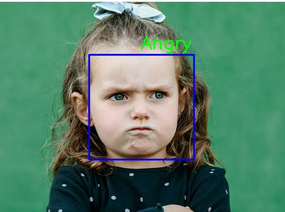
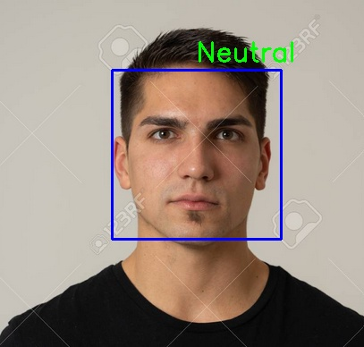
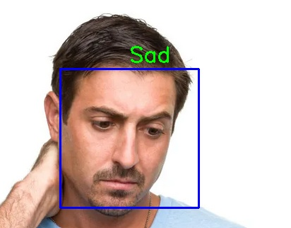
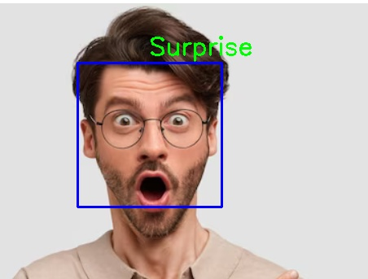

# Facial Recognition and Emotion Detection
----------
 
----------

### Emotion Detection
This topic talks about building a model which can detect an emotion from an image or from a live webcam . There key points to be followed are:

1. Data gathering and  augmentation

   The dataset taken was **"fer2013"**. It can be downloaded through the link "https://github.com/npinto/fer2013". Image augmentation was performed on this data.

2. Model building

   The model architecture consists of CNN Layer, Max Pooling, Flatten and Dropout Layers.

3. Training

   The model was trained  by  using variants of above layers mentioned in model building and by varying hyperparameters. The best model was able to achieve 60.1% of validation accuracy.

4. Testing

   The model was tested with sample images. It can be seen below:

   
   
   
   
#### The model will be able to detect 7 types of emotions:-
 #####  Angry , Sad ,  Neutral ,  Disgust ,  Surprise ,  Fear  , and   Happy

## Usage:

### For  Face Detection, and Emotion Detection Code

Refer to the notebook /Emotion_Detection.ipynb. 
I have trained an emotion detection model and put its trained weights at /Models

### Train your Emotion Detection Model
To train your own emotion detection model, Refer to the notebook /facial_emotion_recognition.ipynb

### For Emotion Detection  using Webcam 
#### Clone the repo:
Run `pip install -r requirementss.txt`  
` python Emotion_Detection.py`

